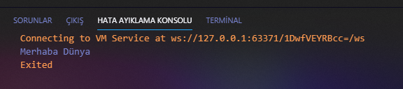

# Merhaba Dünya

Programlama dünyasında gelenektir, bir programlama dili öğrenilirken ilk önce ekrana **“Merhaba Dünya”** çıktısı veren bir program yazılır. Biz de geleneği bozmadan Dart üzerinde Merhaba Dünya uygulaması yazalım. İlk önce kodları görelim. Daha sonra açıklamasını görelim.

```dart
void main() {
  print("Merhaba Dünya");
}
```

Diğer birçok programlama dili gibi Dart'da **main** fonksiyonuna sahip. Bu fonksiyon içerisinde yazdığımız kodlar program tarafından otomatik yürütülecektir. 

**main** fonksiyonunun dönüş tipi **void**'tir. Yani bir değer döndürmez.

**print** fonksiyonu ile `"Merhaba Dünya"` yazısını bastırdık.

Kodlarımızı test etmek için VSCode içerisinde `F5` tuşuna basıyoruz.



Hata ayıklama konsolu sekmesinden yorumlanan kodumuzun sonucuna ulaşabiliriz.

## Komut Satırı

Kodlarımızı komut satırında test etmek istiyorsak;

```dart
dart run main.dart
```

