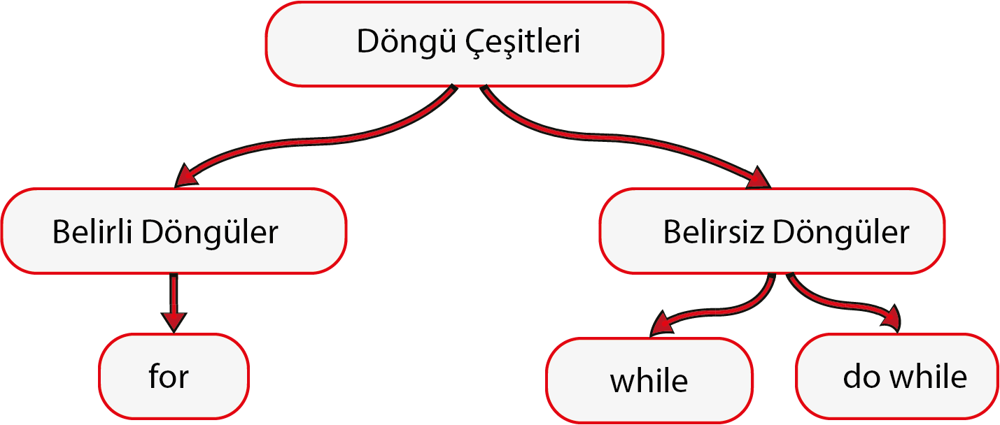

# Döngüler

Bazen, belirli kodların tekrarlanması gerekir. Bu işlemi döngüler ile gerçekleştirebiliriz. 



## 1. For Döngüsü

```dart
main() {
  for (var i = 0; i < 10; i++) {
    print(i);
  }
}
```

`for` terimi ile döngümüzü tanımlıyoruz. `i` isminde değişken oluşturup değerine `0` veriyoruz. `for` döngümüzün `i`'nin değeri `10`'dan küçük olduğu takdirde çalışmasını belirtiyoruz. Her döngü gerçekleştiğinde `i++` ile **i**'nin değerini **1** arttırıyoruz. Döngü içerisinde de `i`'nin değerini ekrana bastırdık.

### 1.1 For in Döngüsü

`For in` döngüsü ile bir listenin içeriği ile ilgili işlemler yapabiliriz.

```dart
main() {
  List isimler = ["kaan", "erkay", "altan"];

  for (var isim in isimler) {
    print(isim);
  }
}
```

`For in`'in `For`'dan farkı belirlediğimiz listenin uzunluğunda işlem yapmasıdır. `isimler` isminde bir liste oluşturduk ve içerisinde birkaç isim girdik.

Daha sonra aşağısında `for` döngüsü oluşturduk ve parantezler içine `var isim` diyerek `isim` değişkeni oluşturduk. `in isimler` diyerek de `isim` değişkeninin her bir `isimler` indeksini kullanmasını sağladık. En sonda `isim` değişkenini ekrana bastırdık.

### 1.2 ForEach Döngüsü Fonksiyonu

Bu döngü diğerlerine göre biraz farklı çalışıyor. Bu döngü bir liste değişkenine bağlanıyor. Örneğimizi görelim;

```dart
main() {
  List isimler = ["kaan", "erkay", "altan"];

  isimler.forEach((isim) {
    print(isim);
  });
}
```

`isimler` adında bir liste oluşturup, içerisine birkaç isim yazdık.

Daha sonra `isimler` değişkenine `forEach()` fonksiyonu iliştirdik. Bu fonksiyonun parametresinde listenin indeksleri için hangi terimi hangi değişkeni oluşturacağımızı yazdık. Son olarak da ekrana `isim` değişkenini bastırdık.

## 2. While Döngüsü

```dart
main() {
  int i = 10;

  while (i != 0) {
    print(i);
    i--;
  }
}
```

`while` döngüsü ilk olarak döngünün gerçekleşmesi için gerekli olan şartı sorgular. Yukarıdaki kodumuzda şart `i`'nin `0`'a eşit olmadığı sürece döngünün çalışmasıdır. Döngü her tekrarlandığında `i`'nin değeri ekrana bastırılır ve `i`'nin değeri `1` eksiltilir. Daha sonra `i`'nin değeri `0`'a kadar düşünce döngü sonlanır.

## 3. Do While Döngüsü

```dart
main() {
  int i = 10;

  do {
    print(i);
    i--;
  } while (i != 0);
}
```

`do while` döngüsü ilk önce döngü işlemlerini gerçekleştirir. Daha sonra koşulu kontrol eder. Bu da `while`'ın ters mantığı oluyor.

